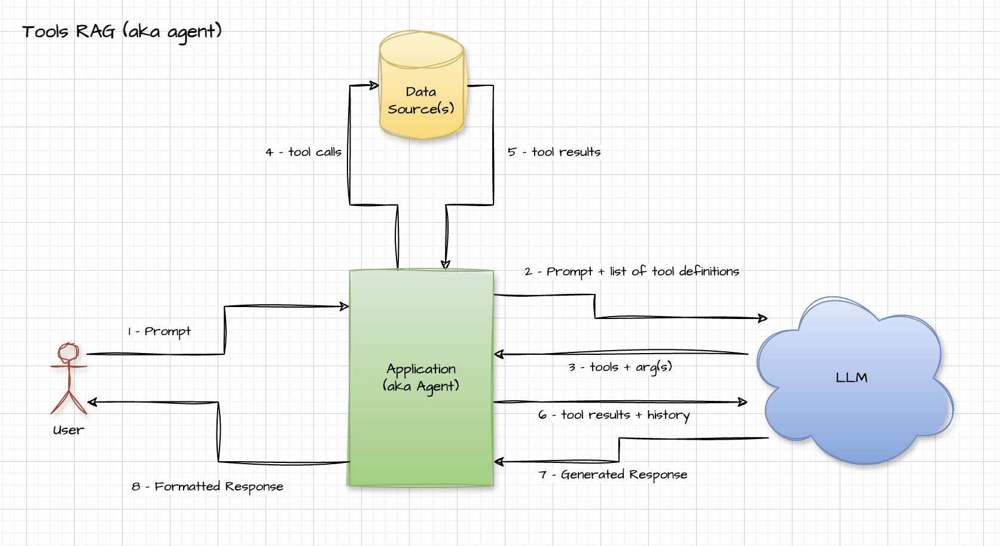
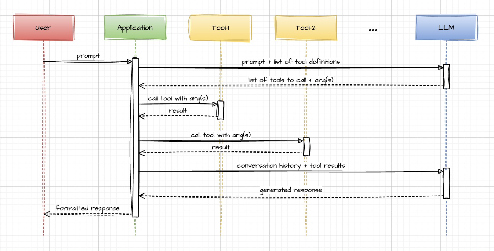
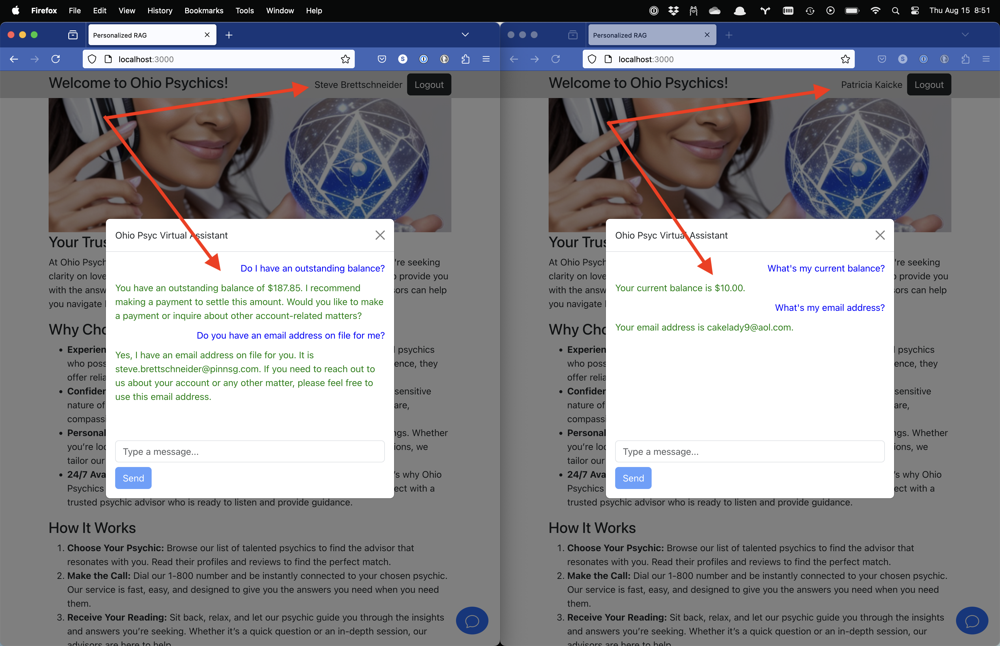

# PERSONALIZED RAG WITH LLM TOOLS #
Presented by: Steve Brettschneider (CVG)

## Synopsis ##

In a prior presentation I talked about how a LLM could be enhanced by a RAG and that
a RAG doesn't have to be sourced from a vector database, but rather anything that
can provided extra contextual data could be of use.  Since then Ollama has updated to
support a feature introduced by OpenAI about a year ago called 'tools'.  With tools
you can send a list of tool definitions to the LLM with your prompt.  Each tool
definition specifies what the tool should be used for and what arguments the tool
expects.  When the LLM is contemplating your prompt, it may decide that it needs
more information in order to answer the prompt.  It might select one or more of the
tools you've defined and ask you to run the tool and return the results of the tool
call to the LLM.  It will then use the tool results in formulating the response.

Here's an updated resource relation diagram to illustrate:

To make it more clear, here's a sequence diagram of the same process:

## Demo Application ##

This demo application is a corporate web-site for a fictitious company called, "Ohio
Psychics".  Once the user is logged in, a "chat" icon appears in the lower-right hand
corner.  Once clicked a chatbot appears on screen for the user to interact with.
This chatbot utilizes the above methodology to look up customer information on-demand
as the user is sending in questions.  Tools that have been crafted for the LLM to
consume include:

* `get_customer_info(customer_id)` - Looks up the account/profile information for a
  given customer.
* `get_customer_transactions(customer_id)` - Looks up all the financial transactions
  for a given customer.

If the user asks a question that the LLM deems to be a account/profile question, it
will return a request for the `get_customer_info` tool to be called.  Likewise if
the LLM thinks the user is asking a financial transaction related question it may
ask for the `get_customer_transactions` tool to be called.

The chatbot code (found in [chatbot.py](./api/chatbot.py) handles interpreting the
LLM's requests, making the calls to the tools and returning the tool results to
the LLM.

**What about security?** - There is a thing called "jailbreaking" in the LLM world.
It refers to talking to the LLM until you've sufficiently confused it in order to
make it break rules that it's been given.  What if a user can convince the LLM that
they are actually some other user?  Can't they trick the LLM into divulging
information that they are not entitled to have?  That's a major feature of _how_
this LLM tool functionality is being employed in this demo application.

In the typical use of tools with LLM's, the LLM specifies all the arguments to be
passed to the tool base on what it's trying to accomplish.  In this application
the argument to both tools is a `customer_id`.  The way that the tool is defined
when sending it to the LLM, we omit the `customer_id` argument.  The LLM doesn't
even know that `customer_id` can/should be specified when calling the tool.  I
just says, "I need you to call `get_customer_info`.

It's our API code that decides what `customer_id` to provide as an argument to the
tool.  The API code reads that value off of the Authentication TOKEN from the
browser.  What this means:  It doesn't matter how confused a nefarious customer
can make the LLM become.  The LLM can only ask for information the is associated
with the logged in user.

**Takeaway** - Handling the above security issue is (IMO) a great example of Pinnacle
people being able to leverage our technical expertise of this topic to differentiate
ourselves from our competition.  Learning the guts of how these technologies work
will allow us to help out customers create solutions that will be more precise
and (more importantly) safe.

## Source Code ##

This directory holds the source code from the personalized RAG presentation.  There are
two sub-directories from this project root:

* api - Holds the source code for a FastAPI Python API project that supports the demo.
* ui - Holds the source code for a ReactJS UI project that supports the demo.

In order for this project to work properly you will need:

1. Node
1. A relatively recent version of Python (3.12.1 is specified in Pipfile)
1. Ollama with Llama3.1 pulled down.

## Directions for starting the API ##

Ensure you have Python >= 3.10 installed on your system.  Things will go much more
smoothly if you have Python 3.12 installed, but it's not strictly required.  If you
don't have `Pipenv` installed, you will want to install it. If you don't have gnu
`make` installed, you may want to consider installing that as well.

Once you have the above taken care of, to setup your Python virtualenv and install
the dependencies simply issue the following command:

    $ make install

Then to run the API:

    $ make api

I've embedded a number of other targets in the `Makefile` that you may want to 
peruse.  Just calling `make` with no arguments will list all the targets I've set
up.

    $ make

## Directions for starting the UI ##

Ensure you have relatively recent versions of node and npm installed on your computer.
Then simply issue the following command to get your dependencies installed:

    $ npm install

To run the UI just enter:

    $ npm start

The project is already configured to proxy /api/* requests to the locally running
API.  Additionally, the CORS setup is configured to just allow everything.  The
chatbot does not utilize the webpack proxy, it talks directly to the API so that
the token streaming looks nice in the browser.

